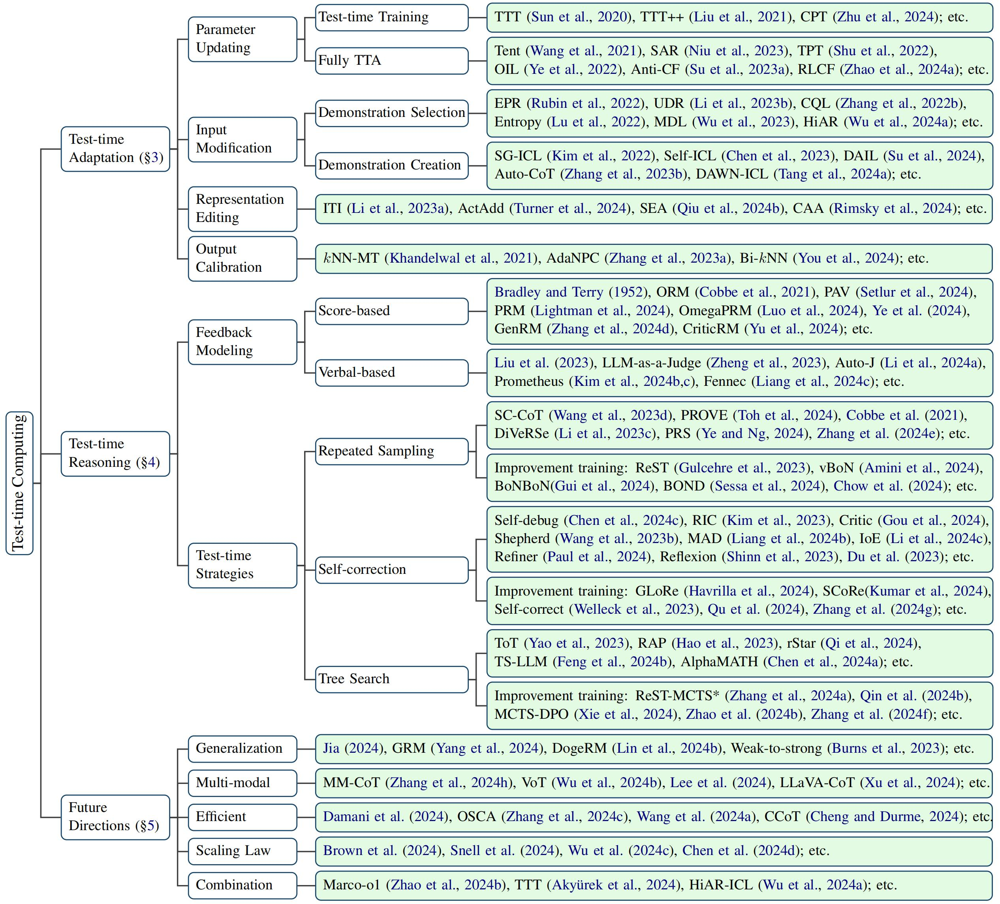

<div align="center">
<h1>Awesome Test-time Computing</h1>
</div>

This repository contains the resources for [*Test-time Computing: from System-1 Thinking to System-2 Thinking*](https://arxiv.org/abs/2501.02497)

## Overview of Test-time Computing:



## Test-time Adaptation
### Updating the Model
* **Test-Time Training with Self-Supervision for Generalization under Distribution Shifts** [ICML 2020] [paper](https://arxiv.org/pdf/1909.13231)
* **MT3: Meta Test-Time Training for Self-Supervised Test-Time Adaption** [AISTATS 2022] [paper](https://arxiv.org/pdf/2103.16201) [code](https://github.com/AlexanderBartler/MT3)
* **Test-Time Training with Masked Autoencoders** [NeurIPS 2022] [paper](https://arxiv.org/pdf/2209.07522)
* **TTT++: When Does Self-Supervised Test-Time Training Fail or Thrive?** [NeurIPS 2021] [paper](https://proceedings.neurips.cc/paper_files/paper/2021/file/b618c3210e934362ac261db280128c22-Paper.pdf) [code](https://github.com/vita-epfl/ttt-plus-plus)
* **Efficient Test-Time Prompt Tuning for Vision-Language Models** [arxiv 2024.8] [paper](https://arxiv.org/pdf/2408.05775)
* **Tent: Fully Test-time Adaptation by Entropy Minimization** [ICLR 2021] [paper](https://arxiv.org/pdf/2006.10726) [code](https://github.com/vita-epfl/ttt-plus-plus)
* **MEMO: Test Time Robustness via Adaptation and Augmentation** [NeurIPS 2022] [paper](https://arxiv.org/pdf/2110.09506) [code](https://github.com/zhangmarvin/memo)
* **The Entropy Enigma: Success and Failure of Entropy Minimization** [arxiv 2024.5] [paper](https://arxiv.org/pdf/2405.05012) [code](https://github.com/oripress/EntropyEnigma)
* **On Pitfalls of Test-Time Adaptation** [ICML 2023] [paper](https://arxiv.org/pdf/2306.03536) [code](https://github.com/lins-lab/ttab)
* **Beware of Model Collapse! Fast and Stable Test-time Adaptation for Robust Question Answering** [EMNLP 2023] [paper](https://aclanthology.org/2023.emnlp-main.803.pdf) [code](https://github.com/yisunlp/Anti-CF)
* **Align Your Prompts: Test-Time Prompting with Distribution Alignment for Zero-Shot Generalization** [NeurIPS 2024] [paper](https://arxiv.org/pdf/2311.01459) 
* **Protected Test-Time Adaptation via Online Entropy Matching: A Betting Approach** [arxiv 2024.8] [paper](https://arxiv.org/pdf/2408.07511) [code](https://github.com/yarinbar/poem)
* **Simulating Bandit Learning from User Feedback for Extractive Question Answering** [ACL 2022] [paper](https://aclanthology.org/2022.acl-long.355.pdf) [code](https://github.com/lil-lab/bandit-qa)
* **Using Interactive Feedback to Improve the Accuracy and Explainability of Question Answering Systems Post-Deployment** [ACL 2022] [paper](https://aclanthology.org/2022.findings-acl.75.pdf) 
* **Test-time Adaptation for Machine Translation Evaluation by Uncertainty Minimization** [ACL 2023] [paper](https://aclanthology.org/2023.acl-long.47.pdf) [code](https://github.com/lil-lab/bandit-qa)
* **COMET: A Neural Framework for MT Evaluation** [EMNLP 2020] [paper](https://aclanthology.org/2020.emnlp-main.213.pdf) 
* **Test-Time Adaptation with CLIP Reward for Zero-Shot Generalization in Vision-Language Models** [ICLR 2023] [paper](https://arxiv.org/pdf/2305.18010) [code](https://github.com/lil-lab/bandit-qa)
* **Improving robustness against common corruptions by covariate shift adaptation** [NeurIPS 2020] [paper](https://arxiv.org/pdf/2006.16971) 
* **Selective Annotation Makes Language Models Better Few-Shot Learners** [arxiv 2022.9] [paper](https://arxiv.org/pdf/2209.01975) [code](https://github.com/xlang-ai/icl-selective-annotation)
* **Test-Time Adaptation with Perturbation Consistency Learning** [arxiv 2023.4] [paper](https://arxiv.org/pdf/2304.12764) 
* **Test-Time Prompt Adaptation for Vision-Language Models** [NeurIPS 2023] [paper](https://proceedings.neurips.cc/paper_files/paper/2023/file/cdd0640218a27e9e2c0e52e324e25db0-Paper-Conference.pdf) 
* **Diverse Data Augmentation with Diffusions for Effective Test-time Prompt Tuning** [ICCV 2023] [paper](https://arxiv.org/pdf/2308.06038) [code](https://github.com/chunmeifeng/DiffTPT)
* **Test-Time Model Adaptation with Only Forward Passes** [ICML 2024] [paper](https://arxiv.org/pdf/2404.01650) [code](https://github.com/mr-eggplant/FOA)
* **Test-Time Low Rank Adaptation via Confidence Maximization for Zero-Shot Generalization of Vision-Language Models** [arxiv 2024.7] [paper](https://arxiv.org/pdf/2407.15913) [code](https://github.com/Razaimam45/TTL-Test-Time-Low-Rank-Adaptation)
* **StreamAdapter: Efficient Test Time Adaptation from Contextual Streams** [arxiv 2024.11] [paper](https://arxiv.org/pdf/2411.09289) 
* **Towards Stable Test-time Adaptation in Dynamic Wild World** [ICLR 2023] [paper](https://arxiv.org/pdf/2302.12400) [code](https://github.com/mr-eggplant/SAR)
* **SoTTA: Robust Test-Time Adaptation on Noisy Data Streams** [NeurIPS 2023] [paper](https://arxiv.org/pdf/2310.10074) [code](https://github.com/taeckyung/SoTTA)
* **Robust Question Answering against Distribution Shifts with Test-Time Adaption: An Empirical Study** [EMNLP 2022] [paper](https://aclanthology.org/2022.findings-emnlp.460.pdf) [code](https://github.com/oceanypt/coldqa-tta)
### Modifying the Input
* **What Makes Good In-Context Examples for GPT-3?** [DeeLIO 2022] [paper](https://aclanthology.org/2022.deelio-1.10.pdf) 
* **In-Context Learning with Iterative Demonstration Selection** [EMNLP 2024] [paper](https://aclanthology.org/2024.findings-emnlp.438.pdf) 
* **Dr.ICL: Demonstration-Retrieved In-context Learning** [arxiv 2023.5] [paper](https://arxiv.org/pdf/2305.14128) 
* **Learning To Retrieve Prompts for In-Context Learning** [NAACL 2022] [paper](https://arxiv.org/pdf/2112.08633) 
* **Unified Demonstration Retriever for In-Context Learning** [ACL 2023] [paper](https://aclanthology.org/2023.acl-long.256.pdf) [code](https://github.com/KaiLv69/UDR)
* **Why Can GPT Learn In-Context? Language Models Secretly Perform Gradient Descent as Meta-Optimizers** [ACL 2023] [paper](https://aclanthology.org/2023.findings-acl.247.pdf) [code](https://github.com/microsoft/LMOps/tree/main/understand_icl)
* **Finding Support Examples for In-Context Learning** [EMNLP 2023] [paper](https://aclanthology.org/2023.findings-emnlp.411.pdf) [code](https://github.com/LeeSureman/ICL_Support_Example)
* **Large Language Models Are Latent Variable Models: Explaining and Finding Good Demonstrations for In-Context Learning** [NeurIPS 2023] [paper](https://arxiv.org/pdf/2301.11916) [code](https://github.com/WANGXinyiLinda/concept-based-demonstration-selection)
* **Fantastically Ordered Prompts and Where to Find Them: Overcoming Few-Shot Prompt Order Sensitivity** [ACL 2022] [paper](https://aclanthology.org/2022.acl-long.556.pdf) 
* **Self-Adaptive In-Context Learning: An Information Compression Perspective for In-Context Example Selection and Ordering** [ACL 2023] [paper](https://aclanthology.org/2023.acl-long.79.pdf) 
* **RetICL: Sequential Retrieval of In-Context Examples with Reinforcement Learning** [arxiv 2024.4] [paper](https://arxiv.org/pdf/2305.14502) 
* **Automatic Chain of Thought Prompting in Large Language Models** [ICLR 2022] [paper](https://arxiv.org/pdf/2210.03493) [code](https://github.com/amazon-science/auto-cot)
* **Self-ICL: Zero-Shot In-Context Learning with Self-Generated Demonstrations** [EMNLP 2023] [paper](https://aclanthology.org/2023.emnlp-main.968.pdf) [code](https://github.com/ntunlplab/Self-ICL)
* **Z-ICL: Zero-Shot In-Context Learning with Pseudo-Demonstrations** [ACL 2023] [paper](https://aclanthology.org/2023.acl-long.129.pdf) 
* **Self-Generated In-Context Learning: Leveraging Auto-regressive Language Models as a Demonstration Generator** [arxiv 2022.6] [paper](https://arxiv.org/pdf/2206.08082) 
* **Demonstration Augmentation for Zero-shot In-context Learning** [ACL 2024] [paper](https://aclanthology.org/2024.findings-acl.846.pdf) [code](https://github.com/yisunlp/DAIL)
### Editing the Representation
* **Plug and Play Language Models: A Simple Approach to Controlled Text Generation** [ICLR 2022] [paper](https://arxiv.org/pdf/1912.02164)
* **Steering Language Models With Activation Engineering** [arxiv 2024.10] [paper](https://arxiv.org/pdf/2308.10248) 
* **Improving Instruction-Following in Language Models through Activation Steering** [arxiv 2024.10] [paper](https://arxiv.org/pdf/2410.12877) 
* **Inference-Time Intervention: Eliciting Truthful Answers from a Language Model** [arxiv 2024.6] [paper](https://arxiv.org/pdf/2306.03341) [code](https://github.com/likenneth/honest_llama) 
* **Refusal in Language Models Is Mediated by a Single Direction** [arxiv 2024.10] [paper](https://arxiv.org/pdf/2406.11717) [code](https://github.com/andyrdt/refusal_direction)
* **In-context Vectors: Making In Context Learning More Effective and Controllable Through Latent Space Steering** [arxiv 2024.2] [paper](https://arxiv.org/pdf/2311.06668) [code](https://github.com/shengliu66/ICV)
* **Investigating Bias Representations in Llama 2 Chat via Activation Steering** [arxiv 2024.2] [paper](https://arxiv.org/pdf/2402.00402) 
* **Personalized Steering of Large Language Models: Versatile Steering Vectors Through Bi-directional Preference Optimization** [arxiv 2024.7] [paper](https://arxiv.org/pdf/2406.00045) [code](https://github.com/CaoYuanpu/BiPO)
* **Spectral Editing of Activations for Large Language Model Alignment** [NeurIPS 2024] [paper](https://arxiv.org/pdf/2405.09719) [code](https://github.com/yfqiu-nlp/sea-llm)
* **Multi-property Steering of Large Language Models with Dynamic Activation Composition** [BlackboxNLP 2024] [paper](https://aclanthology.org/2024.blackboxnlp-1.34.pdf) [code](https://github.com/DanielSc4/Dynamic-Activation-Composition)
### Calibrating the Output
* **Generalization through Memorization: Nearest Neighbor Language Models** [ICLR 2020] [paper](https://arxiv.org/pdf/1911.00172) [code](https://github.com/urvashik/knnlm)
* **Nearest Neighbor Machine Translation** [ICLR 2021] [paper](https://arxiv.org/pdf/2010.00710) [code](https://github.com/facebookresearch/fairseq/tree/main/examples/translation)
* **Efficient Cluster-Based k-Nearest-Neighbor Machine Translation** [ACL 2022] [paper](https://aclanthology.org/2022.acl-long.154.pdf) [code](https://github.com/tjunlp-lab/PCKMT)
* **What Knowledge Is Needed? Towards Explainable Memory for kNN-MT Domain Adaptation** [ACL 2023] [paper](https://arxiv.org/pdf/2211.04052) [code](https://github.com/facebookresearch/fairseq/tree/main/examples/wmt19)
* **Efficient Domain Adaptation for Non-Autoregressive Machine Translation** [ACL 2024] [paper](https://aclanthology.org/2024.findings-acl.810.pdf) [code](https://github.com/Moriarty0923/BIKNN)
* **kNN-NER: Named Entity Recognition with Nearest Neighbor Search** [arxiv 2022.3] [paper](https://arxiv.org/pdf/2203.17103) [code](https://github.com/ShannonAI/KNN-NER.)
* **kNN-CM: A Non-parametric Inference-Phase Adaptation of Parametric Text Classifiers** [EMNLP 2023] [paper](https://aclanthology.org/2023.findings-emnlp.903.pdf) [code](https://github.com/Bhardwaj-Rishabh/kNN-CM)
* **AdaNPC: Exploring Non-Parametric Classifier for Test-Time Adaptation** [ICML 2023] [paper](https://arxiv.org/pdf/2304.12566) [code](https://github.com/yfzhang114/AdaNPC)

## Test-time Reasoning
### Feedback Modeling
#### Score-based
* **Training Verifiers to Solve Math Word Problems** [arxiv 2021.10] [paper](https://arxiv.org/pdf/2110.14168)
* **Advancing LLM Reasoning Generalists with Preference Trees** [arxiv 2024.4] [paper](https://arxiv.org/pdf/2404.02078) [code](https://github.com/OpenBMB/Eurus)
* **V-STaR: Training Verifiers for Self-Taught Reasoners** [COLM 2024] [paper](https://openreview.net/pdf?id=stmqBSW2dV)
* **Solving math word problems with process- and outcome-based feedback** [arxiv 2022.11] [paper](https://arxiv.org/pdf/2211.14275)
* **Let's Verify Step by Step** [ICLR 2024] [paper](https://openreview.net/pdf?id=v8L0pN6EOi) [code](https://github.com/openai/prm800k)
* **Math-Shepherd: Verify and Reinforce LLMs Step-by-step without Human Annotations** [ACL 2024] [paper](https://aclanthology.org/2024.acl-long.510.pdf)
* **Improve Mathematical Reasoning in Language Models by Automated Process Supervision** [arxiv 20224.6] [paper](https://arxiv.org/pdf/2406.06592)
* **Rewarding Progress: Scaling Automated Process Verifiers for LLM Reasoning** [arxiv 20224.10] [paper](https://arxiv.org/pdf/2410.08146)
* **Critique-out-Loud Reward Models** [arxiv 2024.8] [paper](https://arxiv.org/pdf/2408.11791) [code](https://github.com/zankner/CLoud)
* **Improving Reward Models with Synthetic Critiques** [arxiv 2024.5] [paper](https://arxiv.org/pdf/2405.20850)
* **Generative Verifiers: Reward Modeling as Next-Token Prediction** [arxiv 2024.8] [paper](https://arxiv.org/pdf/2408.15240)
* **Self-Generated Critiques Boost Reward Modeling for Language Models** [arxiv 2024.11] [paper](https://arxiv.org/pdf/2411.16646)
#### Verbal-based
* **Is ChatGPT a Good NLG Evaluator? A Preliminary Study** [ACL 2023] [paper](https://aclanthology.org/2023.newsum-1.1.pdf) [code](https://github.com/krystalan/chatgpt_as_nlg_evaluator)
* **ChatGPT as a Factual Inconsistency Evaluator for Text Summarization** [arxiv 2023.3] [paper](https://arxiv.org/pdf/2303.15621) 
* **G-Eval: NLG Evaluation using Gpt-4 with Better Human Alignment** [ACL 2023] [pdf ](https://aclanthology.org/2023.emnlp-main.153.pdf) [code](https://github.com/nlpyang/geval)
* **Can Large Language Models Be an Alternative to Human Evaluations?** [ACL 2023] [paper](https://aclanthology.org/2023.acl-long.870.pdf)
* **LLMs instead of Human Judges? A Large Scale Empirical Study across 20 NLP Evaluation Tasks** [arxiv 2024.6] [paper](https://arxiv.org/pdf/2406.18403)
* **Large Language Models are not Fair Evaluators** [ACL 2024] [paper](https://aclanthology.org/2024.acl-long.511.pdf) [code](https://github.com/i-Eval/FairEval)
* **Large Language Models are Inconsistent and Biased Evaluators** [arxiv 2024.5] [paper](https://arxiv.org/pdf/2405.01724)
* **Judging LLM-as-a-Judge with MT-Bench and Chatbot Arena** [NeurIPS 2023] [paper](https://openreview.net/pdf?id=uccHPGDlao) [code](https://github.com/lm-sys/FastChat/tree/main/fastchat/llm_judge)
* **PandaLM: An Automatic Evaluation Benchmark for LLM Instruction Tuning Optimization** [ICLR 2024] [paper](https://openreview.net/pdf?id=5Nn2BLV7SB)
* **JudgeLM: Fine-tuned Large Language Models are Scalable Judges** [arxiv 2023.10] [paper](https://arxiv.org/pdf/2310.17631) [code](https://github.com/baaivision/JudgeLM)
* **Fennec: Fine-grained Language Model Evaluation and Correction Extended through Branching and Bridging** [arxiv 2024.5] [paper](https://arxiv.org/pdf/2405.12163) [code](https://github.com/dropreg/Fennec)
* **REFINER: Reasoning Feedback on Intermediate Representations** [ACL 2024] [paper](https://aclanthology.org/2024.eacl-long.67.pdf)
* **Shepherd: A Critic for Language Model Generation** [arxiv 2023.8] [paper](https://arxiv.org/pdf/2308.04592) [code](https://arxiv.org/pdf/2308.04592)
* **Generative Judge for Evaluating Alignment** [ICLR 2024] [paper](https://openreview.net/pdf?id=gtkFw6sZGS) [code](https://github.com/GAIR-NLP/auto-j)
* **Can LLMs Produce Faithful Explanations For Fact-checking? Towards Faithful Explainable Fact-Checking via Multi-Agent Debate** [ICLR 2024] [paper](https://arxiv.org/pdf/2402.07401)
   

### Search Strategies
#### Repeated sampling
* **Competition-level code generation with alphacode** [Science 2022] [paper](https://arxiv.org/pdf/2203.07814) [code](https://github.com/google-deepmind/code_contests)
* **Code Llama: Open Foundation Models for Code** [arxiv 2023.8] [paper](https://arxiv.org/pdf/2308.12950) [code](https://github.com/meta-llama/codellama)
* **More Agents Is All You Need** [arxiv 2024.2] [paper](https://arxiv.org/pdf/2402.05120) [code](https://github.com/MoreAgentsIsAllYouNeed/AgentForest)
* **Just Ask One More Time! Self-Agreement Improves Reasoning of Language Models in (Almost) All Scenarios** [ACL 2024] [paper](https://aclanthology.org/2024.findings-acl.230.pdf)
* **Self-Consistency Improves Chain of Thought Reasoning in Language Models** [ICLR 2023] [paper](https://openreview.net/pdf?id=1PL1NIMMrw)
* **Not All Votes Count! Programs as Verifiers Improve Self-Consistency of Language Models for Math Reasoning**[arxiv 2024.10] [paper](https://arxiv.org/pdf/2410.12608) [code](https://github.com/declare-lab/prove)
* **Learning to summarize with human feedback**[NeurIPS 2020] [paper](https://proceedings.neurips.cc/paper_files/paper/2020/file/1f89885d556929e98d3ef9b86448f951-Paper.pdf)
* **Training Verifiers to Solve Math Word Problems**[arxiv 2021.10] [paper](https://arxiv.org/pdf/2110.14168)
* **WebGPT: Browser-assisted question-answering with human feedback** [arxiv 2021.12] [paper](https://arxiv.org/pdf/2112.09332)
* **Making Language Models Better Reasoners with Step-Aware Verifier** [ACL 2023] [paper](https://aclanthology.org/2023.acl-long.291.pdf) [code](https://github.com/microsoft/DiVeRSe)
* **Accelerating Best-of-N via Speculative Rejection** [ICML 2024] [paper](https://openreview.net/pdf?id=dRp8tAIPhj)
* **TreeBoN: Enhancing Inference-Time Alignment with Speculative Tree-Search and Best-of-N Sampling** [arxiv 2024.10] [paper](https://arxiv.org/pdf/2410.16033)
* **Fast Best-of-N Decoding via Speculative Rejection** [NeurIPS 2024] [paper](https://openreview.net/pdf?id=348hfcprUs)
* **Adaptive Inference-Time Compute: LLMs Can Predict if They Can Do Better, Even Mid-Generation** [arxiv 2024.10] [paper](https://arxiv.org/pdf/2410.02725) [code](https://github.com/rohinmanvi/Capability-Aware_and_Mid-Generation_Self-Evaluations)
* **Preference-Guided Reflective Sampling for Aligning Language Models** [EMNLP 2024] [paper](https://aclanthology.org/2024.emnlp-main.1206.pdf) [code](https://github.com/nusnlp/PRS)
* **Reinforced Self-Training (ReST) for Language Modeling**[arxiv 2023.8] [paper](https://arxiv.org/pdf/2308.08998) 
* **Variational Best-of-N Alignment** [arxiv 2024.7] [paper](https://arxiv.org/pdf/2407.06057)  
* **BoNBoN Alignment for Large Language Models and the Sweetness of Best-of-n Sampling** [NeurIps 2024] [paper](https://openreview.net/pdf?id=haSKMlrbX5)
* **BOND: Aligning LLMs with Best-of-N Distillation** [arxiv 2024.7] [paper](https://arxiv.org/pdf/2407.14622)
* **Inference-Aware Fine-Tuning for Best-of-N Sampling in Large Language Models** [arxiv 2024.12] [paper](https://arxiv.org/pdf/2412.15287)
#### Self-correction
* **Reflexion: Language Agents with Verbal Reinforcement Learning** [arxiv 2023.3] [paper](https://arxiv.org/pdf/2303.11366) [code](https://github.com/noahshinn/reflexion)
* **Interscript: A dataset for interactive learning of scripts through error feedback** [arxiv 2021.12] [paper](https://arxiv.org/pdf/2112.07867) [code](https://github.com/allenai/interscript)
* **NL-EDIT: Correcting Semantic Parse Errors through Natural Language Interaction** [ACL 2021] [paper](https://aclanthology.org/2021.naacl-main.444.pdf) [code](https://github.com/MSR-LIT/NLEdit/)
* **Learning to repair: Repairing model output errors after deployment using a dynamic memory of feedback** [ACL 2022] [paper](https://aclanthology.org/2022.findings-naacl.26.pdf) [code](https://github.com/allenai/interscript)
* **CRITIC: Large Language Models Can Self-Correct with Tool-Interactive Critiquing** [ICLR 2024] [paper](https://openreview.net/pdf?id=Sx038qxjek) [code](https://github.com/microsoft/ProphetNet/tree/master/CRITIC)
* **Teaching Large Language Models to Self-Debug** [ICLR 2024] [paper](https://openreview.net/pdf?id=KuPixIqPiq)
* **RARR: Researching and Revising What Language Models Say, Using Language Models** [ACL 2023] [paper](https://aclanthology.org/2023.acl-long.910.pdf) [code](https://github.com/anthonywchen/RARR)
* **Graph-based, Self-Supervised Program Repair from Diagnostic Feedback** [ICML 2020] [paper](https://arxiv.org/pdf/2005.10636)
* **Improving Factuality and Reasoning in Language Models through Multiagent Debate** [arxiv 2023.5] [paper](https://arxiv.org/pdf/2305.14325) [code](https://github.com/composable-models/llm_multiagent_debate)
* **Examining Inter-Consistency of Large Language Models Collaboration: An In-depth Analysis via Debate** [EMNLP 2023] [paper](https://aclanthology.org/2023.findings-emnlp.508.pdf) [code](https://github.com/Waste-Wood/FORD)
* **Encouraging Divergent Thinking in Large Language Models through Multi-Agent Debate** [EMNLP 2024] [paper](https://arxiv.org/pdf/2305.19118) [code](https://github.com/Skytliang/Multi-Agents-Debate)
* **ReConcile: Round-Table Conference Improves Reasoning via Consensus among Diverse LLMs** [ACL 2024] [paper](https://aclanthology.org/2024.acl-long.381.pdf) [code](https://github.com/dinobby/ReConcile)
* **Mixture-of-Agents Enhances Large Language Model Capabilities** [arxiv 2024.6] [paper](https://arxiv.org/pdf/2406.04692) [code](https://github.com/togethercomputer/moa)
* **Can LLMs Produce Faithful Explanations For Fact-checking? Towards Faithful Explainable Fact-Checking via Multi-Agent Debate** [arxiv 2024.7] [paper](https://arxiv.org/pdf/2402.07401)
* **Debating with More Persuasive LLMs Leads to More Truthful Answers** [ICML 2024] [paper](https://openreview.net/pdf?id=iLCZtl7FTa) [code](https://github.com/ucl-dark/llm_debate)
* **ChatEval: Towards Better LLM-based Evaluators through Multi-Agent Debate** [ICLR 2024] [pdf ](https://openreview.net/pdf?id=FQepisCUWu)
* **ChainLM: Empowering Large Language Models with Improved Chain-of-Thought Prompting** [IREC 2024] [paper](https://aclanthology.org/2024.lrec-main.265.pdf)
* **Are You Sure? Challenging LLMs Leads to Performance Drops in The FlipFlop Experiment** [arxiv 2023.11] [paper](https://arxiv.org/pdf/2311.08596)
* **MultiAgent Collaboration Attack: Investigating Adversarial Attacks in Large Language Model Collaborations via Debate** [arxiv 2024.6] [paper](https://arxiv.org/pdf/2406.14711) 
* **Teaching Models to Balance Resisting and Accepting Persuasion** [arxiv 2024.10] [paper]([https://arxiv.org/pdf/2410.14596]) [code](https://github.com/esteng/persuasion_balanced_training)
* **GroupDebate: Enhancing the Efficiency of Multi-Agent Debate Using Group Discussion** [arxiv 2024.9] [paper](https://arxiv.org/pdf/2409.14051)
* **Improving Multi-Agent Debate with Sparse Communication Topology** [arxiv 2024.6] [paper](https://arxiv.org/pdf/2406.11776)
* **Self-Rewarding Language Models** [arxiv 2024.1] [paper](https://arxiv.org/pdf/2401.10020)
* **Constitutional AI: Harmlessness from AI Feedback** [arxiv 2022.12] [paper](https://arxiv.org/pdf/2212.08073) [code](https://github.com/anthropics/ConstitutionalHarmlessnessPaper)
* **Self-Refine: Iterative Refinement with Self-Feedback** [NeurIPS 2023] [paper](https://openreview.net/pdf?id=S37hOerQLB)
* **Language Models can Solve Computer Tasks** [arxiv 2023.3] [paper](https://arxiv.org/pdf/2303.17491) [code](https://github.com/posgnu/rci-agent)
* **Confidence Matters: Revisiting Intrinsic Self-Correction Capabilities of Large Language Models** [arxiv 2024.2] [paper](https://arxiv.org/pdf/2402.12563) [code](https://github.com/MBZUAI-CLeaR/IoE-Prompting)
* **Is Self-Repair a Silver Bullet for Code Generation?** [ICLR 2024] [paper](https://openreview.net/pdf?id=y0GJXRungR) [code](https://github.com/theoxo/self-repair)
* **Large Language Models Cannot Self-Correct Reasoning Yet** [ICLR 2024] [paper](https://openreview.net/pdf?id=IkmD3fKBPQ)
* **Reasoning in Token Economies: Budget-Aware Evaluation of LLM Reasoning Strategies** [arxiv 2024.6] [paper](https://arxiv.org/pdf/2406.06461)
* **Can Large Language Models Really Improve by Self-critiquing Their Own Plans?** [arxiv 2023.10] [paper](https://arxiv.org/pdf/2310.08118)
* **GPT-4 Doesn't Know It's Wrong: An Analysis of Iterative Prompting for Reasoning Problems** [arxiv 2023.10] [paper](https://arxiv.org/pdf/2310.12397)
* **When Can LLMs Actually Correct Their Own Mistakes? A Critical Survey of Self-Correction of LLMs** [arxiv 2024.6] [paper](https://arxiv.org/pdf/2406.01297) 
* **LLMs cannot find reasoning errors, but can correct them given the error location** [ACL 2024] [paper](https://aclanthology.org/2024.findings-acl.826.pdf) [code](https://github.com/WHGTyen/BIG-Bench-Mistake)
* **Self-critiquing models for assisting human evaluators** [arxiv 2022.6] [paper](https://arxiv.org/pdf/2206.05802)
* **Recursive Introspection: Teaching Language Model Agents How to Self-Improve** [arxiv 2024.7] [paper](https://arxiv.org/pdf/2407.18219)
* **Embedding Self-Correction as an Inherent Ability in Large Language Models for Enhanced Mathematical Reasoning** [arxiv 2024.10] [paper](https://arxiv.org/pdf/2410.10735)
* **Learn Beyond The Answer: Training Language Models with Reflection for Mathematical Reasoning** [arxiv 2024.6] [paper](https://arxiv.org/pdf/2406.12050) [code](https://github.com/ytyz1307zzh/RefAug)
* **GLoRe: When, Where, and How to Improve LLM Reasoning via Global and Local Refinements** [arxiv 2024.2] [paper](https://arxiv.org/pdf/2402.10963) 
* **Generating Sequences by Learning to Self-Correct** [ICLR 2023] [paper](https://openreview.net/pdf?id=hH36JeQZDaO) [code](https://github.com/wellecks/self_correction)
* **Training Language Models to Self-Correct via Reinforcement Learning** [arxiv 2024.9] [paper](https://arxiv.org/pdf/2409.12917)
#### Tree search
* **Tree of Thoughts: Deliberate Problem Solving with Large Language Models** [NeurIPS 2023] [paper](https://arxiv.org/pdf/2305.10601) [code](https://github.com/princeton-nlp/tree-of-thought-llm)
* **Self-Evaluation Guided Beam Search for Reasoning** [NeurIPS 2023] [paper](https://openreview.net/pdf?id=Bw82hwg5Q3) [code](https://github.com/YuxiXie/SelfEval-Guided-Decoding)
* **Reasoning with Language Model is Planning with World Model** [EMNLP 2023] [paper](https://aclanthology.org/2023.emnlp-main.507.pdf) [code](https://github.com/maitrix-org/llm-reasoners)
* **Accessing GPT-4 level Mathematical Olympiad Solutions via Monte Carlo Tree Self-refine with LLaMa-3 8B** [arxiv 2024.6] [paper](https://arxiv.org/pdf/2406.07394) [code](https://github.com/trotsky1997/MathBlackBox)
* **Reasoning with Language Model is Planning with World Model** [EMNLP 2023] [paper](https://aclanthology.org/2023.emnlp-main.507.pdf) [code](https://github.com/maitrix-org/llm-reasoners)
* **Alphazero-like Tree-Search can Guide Large Language Model Decoding and Training** [arxiv 2023.9] [paper](https://arxiv.org/pdf/2309.17179)
* **Mutual Reasoning Makes Smaller LLMs Stronger Problem-Solvers** [arxiv 2024.8] [paper](https://arxiv.org/pdf/2408.06195) [code](https://github.com/zhentingqi/rStar)
* **Interpretable Contrastive Monte Carlo Tree Search Reasoning** [arxiv 2024.10] [paper](https://arxiv.org/pdf/2410.01707) [code](https://github.com/zitian-gao/SC-MCTS)
* **ReST-MCTS: LLM Self-Training via Process Reward Guided Tree Search** [arxiv 2024.6] [pdf ](https://arxiv.org/pdf/2406.03816) [code](https://github.com/THUDM/ReST-MCTS)
* **Monte Carlo Tree Search Boosts Reasoning via Iterative Preference Learning** [arxiv 2024.5] [paper](https://arxiv.org/pdf/2405.00451) [code](https://github.com/YuxiXie/MCTS-DPO)
* **O1 Replication Journey: A Strategic Progress Report -- Part 1** [arxiv 2024.10] [paper](https://arxiv.org/pdf/2410.18982) [code](https://github.com/GAIR-NLP/O1-Journey)
* **Marco-o1: Towards Open Reasoning Models for Open-Ended Solutions** [arxiv 2024.11] [paper](https://arxiv.org/pdf/2411.14405) [code](https://github.com/AIDC-AI/Marco-o1)
* **o1-Coder: an o1 Replication for Coding** [arxiv 2024.12] [paper](https://arxiv.org/pdf/2412.00154) [code](https://github.com/ADaM-BJTU/o1-coder)


##  Future Directions
### Generalizable System-2 Model
* **DogeRM: Equipping Reward Models with Domain Knowledge through Model Merging** [EMNLP 2024] [paper](https://arxiv.org/pdf/2407.01470) [code](https://github.com/MiuLab/DogeRM)
* **Regularizing Hidden States Enables Learning Generalizable Reward Model for LLMs** [NeurIPS 2024] [paper](https://arxiv.org/pdf/2406.10216) [code](https://github.com/YangRui2015/Generalizable-Reward-Model)
* **Generalizing Reward Modeling for Out-of-Distribution Preference Learning** [ECML-PKDD 2024] [paper](https://arxiv.org/pdf/2402.14760) [code](https://github.com/jiachenwestlake/OODPL)
* **Weak-to-Strong Generalization: Eliciting Strong Capabilities With Weak Supervision** [arxiv 2023.12] [paper](https://arxiv.org/pdf/2312.09390)
### Multimodal Reasoning
* **Test-Time Adaptation with CLIP Reward for Zero-Shot Generalization in Vision-Language Models** [ICLR 2024] [paper](https://arxiv.org/pdf/2305.18010) [code](https://github.com/lil-lab/bandit-qa)
* **Multimodal Chain-of-Thought Reasoning in Language Models** [TMLR 2024] [paper](https://arxiv.org/pdf/2302.00923) [code](https://github.com/amazon-science/mm-cot)
* **Mind's Eye of LLMs: Visualization-of-Thought Elicits Spatial Reasoning in Large Language Models** [NeurIPS 2024] [paper](https://arxiv.org/pdf/2404.03622)
* **KAM-CoT: Knowledge Augmented Multimodal Chain-of-Thoughts Reasoning** [AAAI 2024] [paper](https://arxiv.org/pdf/2401.12863)
* **Multimodal Reasoning with Multimodal Knowledge Graph** [ACL 2024] [paper](https://arxiv.org/pdf/2406.02030)
* **Interleaved-Modal Chain-of-Thought** [arxiv 2024.11] [paper](https://arxiv.org/pdf/2411.19488)
* **LLaVA-CoT: Let Vision Language Models Reason Step-by-Step** [arxiv 2024.11] [paper](https://arxiv.org/pdf/2411.10440) [code](https://github.com/PKU-YuanGroup/LLaVA-CoT)
### Efficiency and Performance Trade-off
* **Learning How Hard to Think: Input-Adaptive Allocation of LM Computation** [arxiv 2024.10] [paper](https://arxiv.org/pdf/2410.04707)
* **Scaling LLM Inference with Optimized Sample Compute Allocation** [arxiv 2024.10] [paper](https://arxiv.org/pdf/2410.22480) [code](https://github.com/LeiLiLab/OSCA)
* **Reasoning in Token Economies: Budget-Aware Evaluation of LLM Reasoning Strategies** [EMNLP 2024] [paper](https://arxiv.org/pdf/2406.06461)
* **Token-Budget-Aware LLM Reasoning** [arxiv 2024.12] [paper](https://arxiv.org/pdf/2412.18547) [code](https://github.com/GeniusHTX/TALE)
* **Compressed Chain of Thought: Efficient Reasoning Through Dense Representations** [arxiv 2024.12] [paper](https://arxiv.org/pdf/2412.13171)
### Scaling Law
* **Large Language Monkeys: Scaling Inference Compute with Repeated Sampling** [arxiv 2024.9] [paper](https://arxiv.org/pdf/2407.21787)
* **Scaling LLM Test-Time Compute Optimally can be More Effective than Scaling Model Parameters** [arxiv 2024.8] [paper](https://arxiv.org/pdf/2408.03314)
* **Inference Scaling Laws: An Empirical Analysis of Compute-Optimal Inference for Problem-Solving with Language Models** [arxiv 2024.10] [paper](https://arxiv.org/pdf/2408.00724) [code](https://github.com/thu-wyz/inference_scaling)
* **A Simple and Provable Scaling Law for the Test-Time Compute of Large Language Models** [arxiv 2024.11] [paper](https://arxiv.org/pdf/2411.19477)
### Strategy Combination
* **The Surprising Effectiveness of Test-Time Training for Abstract Reasoning** [arxiv 2024.11] [paper](https://arxiv.org/pdf/2411.07279) [code](https://github.com/ekinakyurek/marc)
* **Marco-o1: Towards Open Reasoning Models for Open-Ended Solutions** [arxiv 2024.11] [paper](https://arxiv.org/pdf/2411.14405) [code](https://github.com/AIDC-AI/Marco-o1)
* **Beyond Examples: High-level Automated Reasoning Paradigm in In-Context Learning via MCTS** [arxiv 2024.11] [paper](https://arxiv.org/pdf/2411.18478)

## Reference
If our survey is helpful to your research, please cite our paper:
```
@article{ji2025test,
  title={Test-time Computing: from System-1 Thinking to System-2 Thinking},
  author={Ji, Yixin and Li, Juntao and Ye, Hai and Wu, Kaixin and Xu, Jia and Mo, Linjian and Zhang, Min},
  journal={arXiv preprint arXiv:2501.02497},
  year={2025}
}
```
